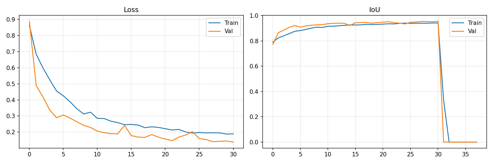
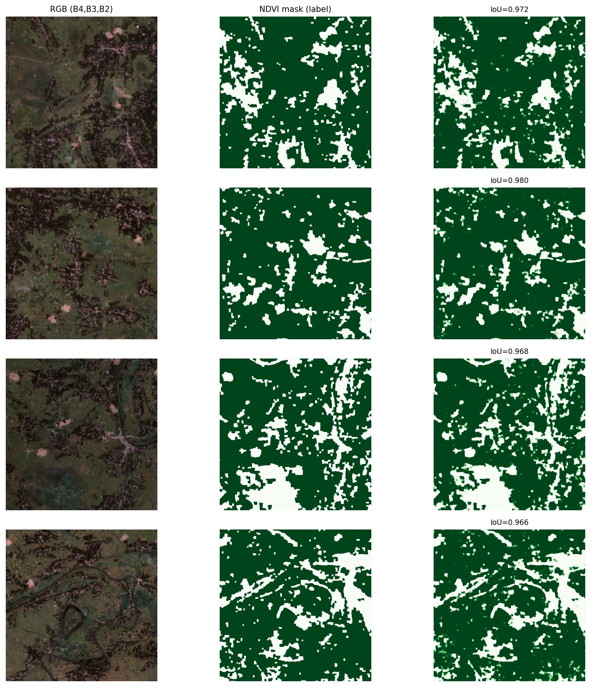

# Mangrove Segmentation v6 — Sentinel-2 Remote Sensing

**Production-grade semantic segmentation pipeline for mangrove ecosystems using Sentinel-2 multispectral imagery.**

Trained on **Kaggle T4×2 (30GB VRAM)** with TensorFlow + mixed precision. Optimized for research and real-world conservation monitoring.

---

## 📊 Training Results





---

## 📥 Model Download (Important)

The trained model is **~180 MB**, so it is available via **GitHub Releases**:

### → **[Download Latest Release](https://github.com/aayushraman07/mangrove-segmentation/releases)**

**Files to download:**
- `mangrove_v6.keras` (main model)
- `mangrove_v6_norm_stats.npz` (normalization statistics)

**After downloading**, place both files in the **project root folder**.

---

## 🚀 Quick Start - Inference

```bash
# 1. Drone Photo
python infer.py --input path/to/your/drone.jpg --mode drone --threshold 0.5

# 2. Drone Video (with temporal smoothing)
python infer.py --input path/to/your/video.mp4 --mode video --every-n 5 --threshold 0.5
